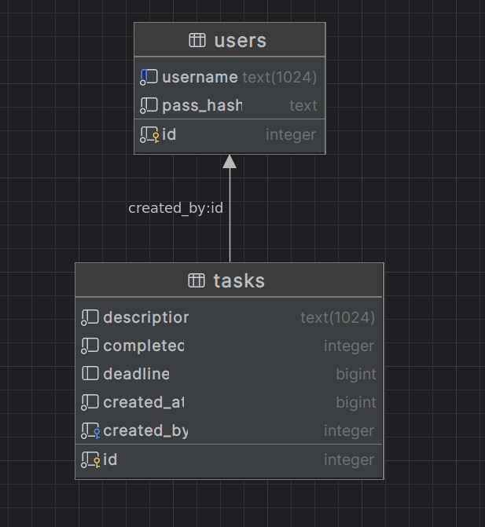

## Description

Demo TODO app backend built with [NestJS](https://nestjs.com/).

## App architecture

The app tries to loosely follow the principles of behind [Hexagonal Architecture](https://en.wikipedia.org/wiki/Hexagonal_architecture_(software)).
It's split into 3 main modules, glued together in the main `AppModule`.

### Domain
Core module where all business logic resides.

This is where all business related enties are defined, as well as all the services used by the adapters bellow to communicate with each other.
It's also the module glueing the adapters described bellow, and where all data should flow through.

### API
Driver-adapter containing all the necessary code for the application's REST API.
It defines HTTP specific logic, as well as handling the authentication specific for this entrypoint.

### DB
Driven-adapter with all the infrastructure related code for handling persistence of data.
It's current implementation supports the SQLite database and defines the following schema:


## Dependencies

The project was built to run on the latest LTS node version (20).
It can be installed using [nvm](https://github.com/nvm-sh/nvm) like this:
```bash
nvm install --lts --latest-npm
```

## Installation

```bash
$ npm install
```

## Running the app

```bash
# development
$ npm run start

# watch mode
$ npm run start:dev
```

## Test

```bash
# unit tests
$ npm run test

# tests for each main module
$ npm run test:domain
$ npm run test:api
$ npm run test:db

# test coverage
$ npm run test:cov
```

**Note:** The tests as they are are only a proof of concept, and it's missing coverage over most of the application.
The app is also missing some end-to-end tests.

## Using the application

The application only has a REST api to interact with it, protected through with basic auth.
It's documented using OpenAPI in `http://localhost:3000/api`

The only public endpoint is to register a new user:
```bash
$ curl -H 'Content-Type:application/json' \
    -X POST http://localhost:3000/auth/register \
    --data '{"username": "foo", "password": "bar"}'
```

After registration, tasks can be managed through the endpoint family in `http://localhost:3000/tasks`
| Method | URI        | Description              |
| ------ | ---        | -----------              |
| GET    | /tasks     | Lists tasks              |
| GET    | /tasks/:id | Gets a task by it's ID   |
| POST   | /tasks     | Creates a new task       |
| PATCH  | /tasks/:id | Updates an existing task |
| DELETE | /tasks/:id | Deletes an existing task |
